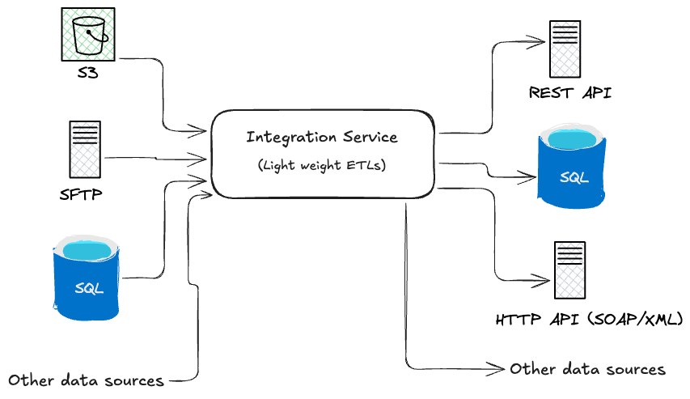
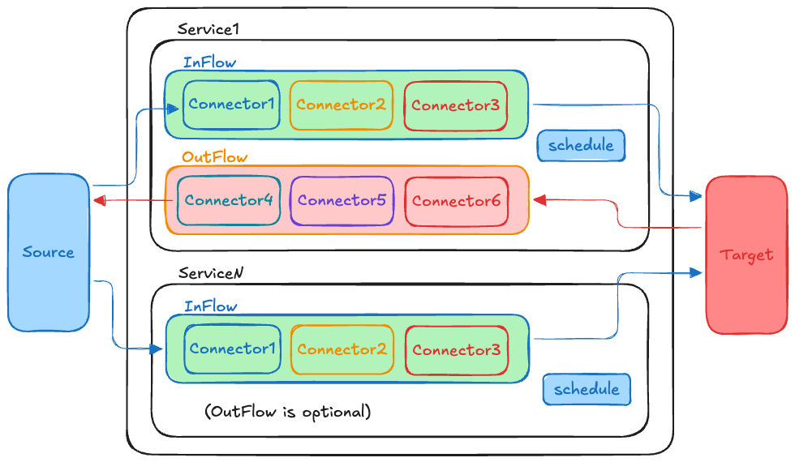

Documentation for IntBricks Integration Service (IIS). [Contact us](mailto:info@intbricks.com) for a product download link and a key.

## Concepts, System Design and User guide

IntBrick Integration Service (IIS) is a tool that can be used to connect heterogeneous systems together
using re-usable, configuration driven components. It enables users to build ETL (Extract, Transform, Load), 
reverse-ETL, or ELT (Extract, Load, Transform) processes, supports connecting different protocols and data formats without the
need to write a lot of glue code. The target end users are developers, sysadmins, administrative users without a lot of technical background.

### System Design
#### Concepts

* Integration Service can be configured using easy to domain specific langauge. The langauge is based on
  [HCL](https://github.com/hashicorp/hcl) and similar to Terraform, enabling easy development and maintenance of integrations. 
* Connection - A connection represent a connection/communication channel to an external data source such as database connection, HTTP connection etc..
* Connector - A unit of functionality that provides a specific functionality. Examples:
    * AWS S3 connector provides functionality to interact with AWS S3.
    * REST connector provides functionality to interact with a REST service.
* Service - A service arrange a set of connectors in a logical flow to get a unit useful work done (for example uploading a large file into an AWS S3 bucket).
    * Service has two flows: `InFlow` (denoted by `in_flow`) and `OutFlow` (denoted by `out_flow`). These flows represent incoming and outgoing flows.
    * `InFlow` represents the source to target path (in a request/response pattern request path).
    * `OutFlow` represents the target to source path (in a request/response pattern response path). `OutFlow` is optional, making a service just with an `InFlow` an [ETL](https://en.wikipedia.org/wiki/Extract,_transform,_load) process.
* Schedule - Service logic is executed in the define schedule - can be either in a scheduler, an external event or by on-demand (invoke by the admin API).

These concepts are shown in the following diagram.

### Product Documentation 
* [Tutorial](docs/tutorial.md)
* [Reference](docs/reference.md)
* [Standard Library](docs/stdlib.md)
     
### Sample Repository
